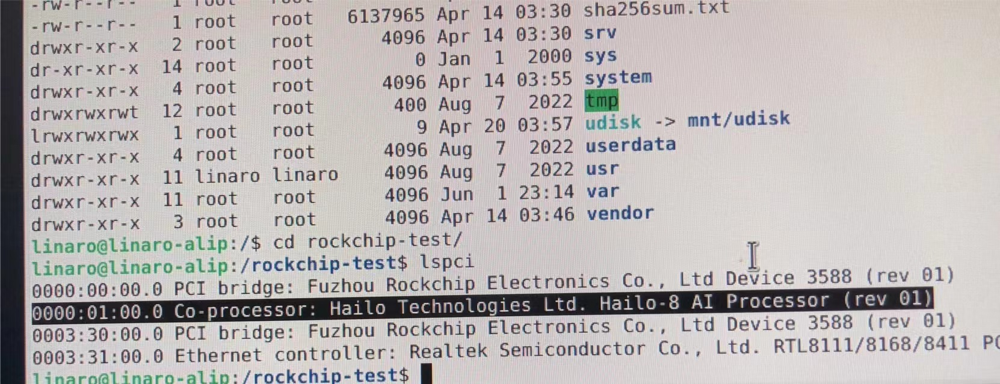
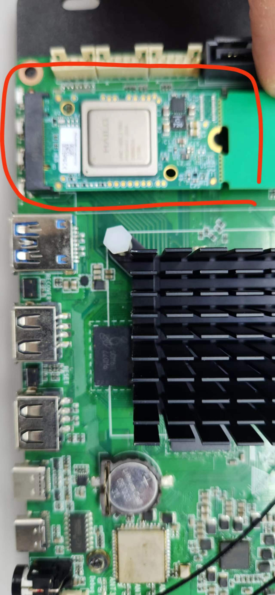

# Compiling-HailoRT-PCI-Driver-in-RK3588-SDK
Compiling HailoRT PCI Driver in RK3588 SDK

# Back to SDK and following the commands to build Hailo PCI Driver
```shell
cd SDK/kernel/driver
git clone https://github.com/hailo-ai/hailort-drivers.git
```
# or specify the version to download
```shell
git clone --depth 1 -b v4.xx.x https://github.com/hailo-ai/hailort-drivers.git
```
# Important!! confirm downloaded Hailort-Driver version
```shell
git -C hailort-drivers/ log -1  # tag: v4.xx.0 

echo "obj-y       += hailort-drivers/linux/pcie/" >> Makefile
cd ../../
./build.sh kernel
```
# check if hailo_pci.ko is builtfile kernel/drivers/hailort-drivers/linux/pcie/hailo_pci.ko


- Compiling HailoRT PCI Driver in SDK


- lspci


- HailoRT Module install


[ko file download](./Documents/hailo_pci.ko)

# Contacts

- Website: www.we-signage.com
- https://we-signage.en.made-in-china.com/
- E-mail: dennis@we-signage.com
- MP/Whatsapp/Wechat: + 86 13349909990
- Skype: solled686